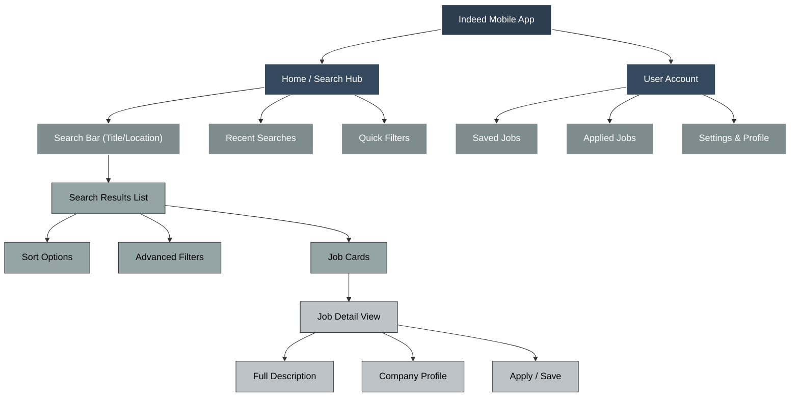

```mermaid
graph TD
    Root[Indeed Mobile App]
    
    %% Level 1
    Root --> L1_Home[Home / Search Hub]
    Root --> L1_Account[User Account]
    
    %% Level 2: Home Branch
    L1_Home --> L2_SearchBar["Search Bar (Title/Location)"]
    L1_Home --> L2_Recent[Recent Searches]
    L1_Home --> L2_Filters[Quick Filters]
    
    %% Level 3: Search Results
    L2_SearchBar --> L3_Results[Search Results List]
    L3_Results --> L3_Results_Sort[Sort Options]
    L3_Results --> L3_Results_Filter[Advanced Filters]
    L3_Results --> L3_Results_Cards[Job Cards]
    
    %% Level 4: Job Detail
    L3_Results_Cards --> L4_Detail[Job Detail View]
    L4_Detail --> L4_Desc[Full Description]
    L4_Detail --> L4_Company[Company Profile]
    L4_Detail --> L4_Action[Apply / Save]
    
    %% Level 2: Account Branch
    L1_Account --> L2_Saved[Saved Jobs]
    L1_Account --> L2_Applied[Applied Jobs]
    L1_Account --> L2_Settings[Settings & Profile]

    %% Styling
    classDef root fill:#2c3e50,stroke:#fff,color:#fff,stroke-width:2px;
    classDef level1 fill:#34495e,stroke:#fff,color:#fff;
    classDef level2 fill:#7f8c8d,stroke:#fff,color:#fff;
    classDef level3 fill:#95a5a6,stroke:#333,color:#000;
    classDef level4 fill:#bdc3c7,stroke:#333,color:#000;
    
    class Root root;
    class L1_Home,L1_Account level1;
    class L2_SearchBar,L2_Recent,L2_Filters,L2_Saved,L2_Applied,L2_Settings level2;
    class L3_Results,L3_Results_Sort,L3_Results_Filter,L3_Results_Cards level3;
    class L4_Detail,L4_Desc,L4_Company,L4_Action level4;
```